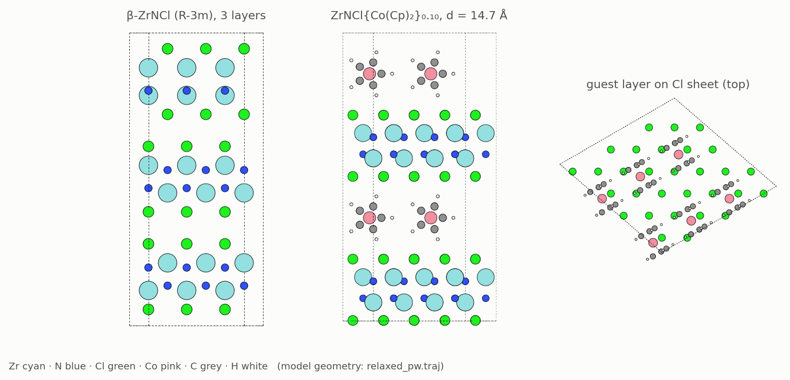
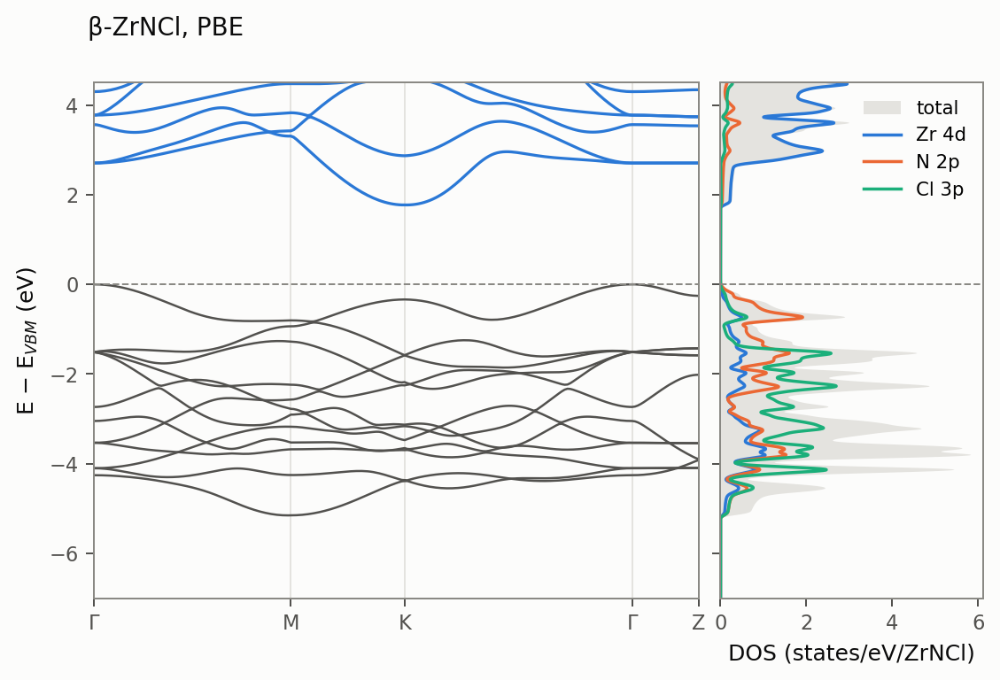
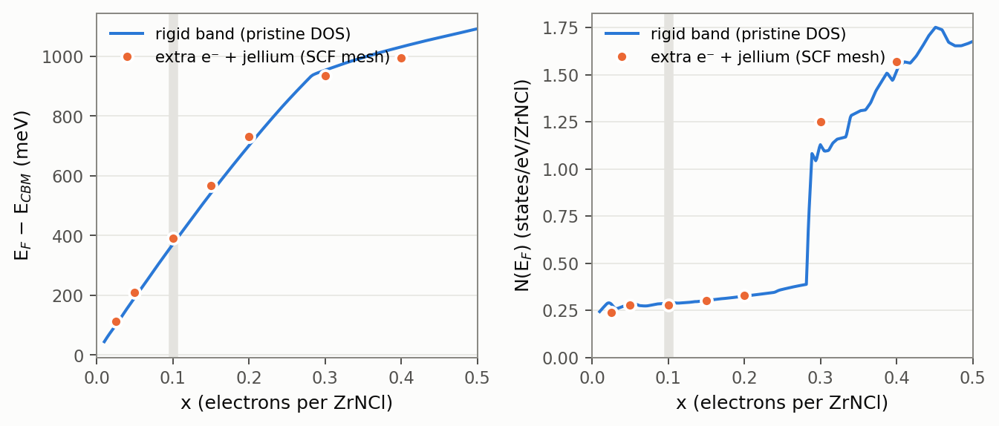
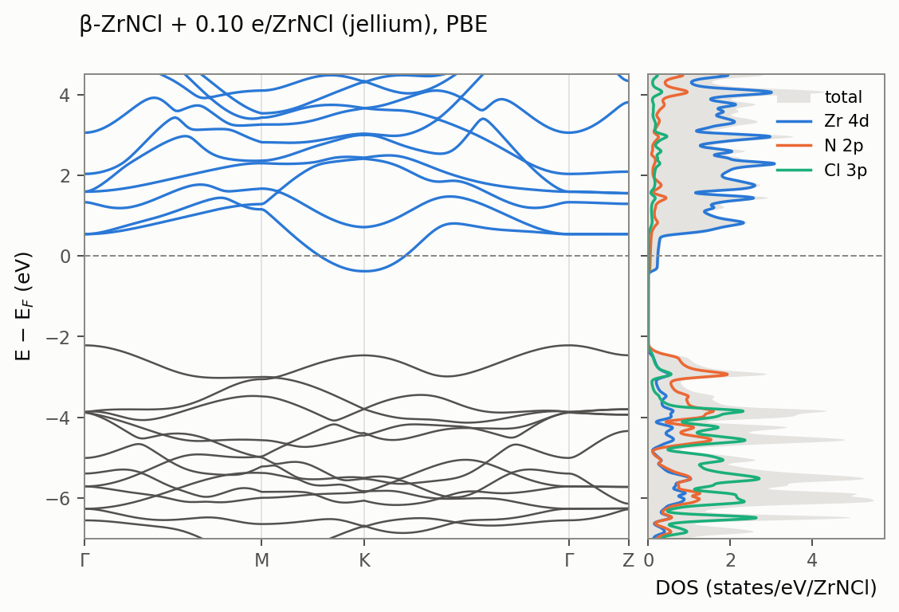
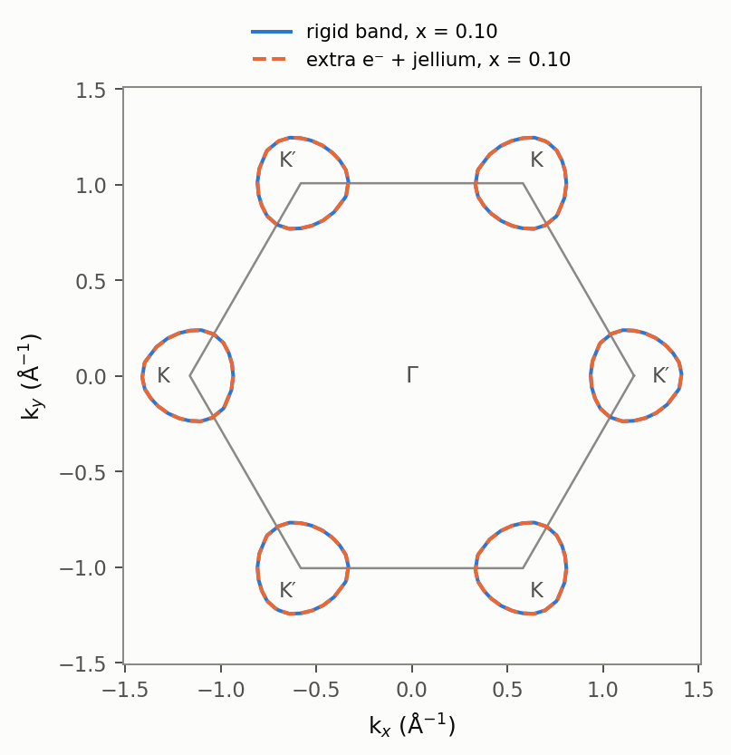
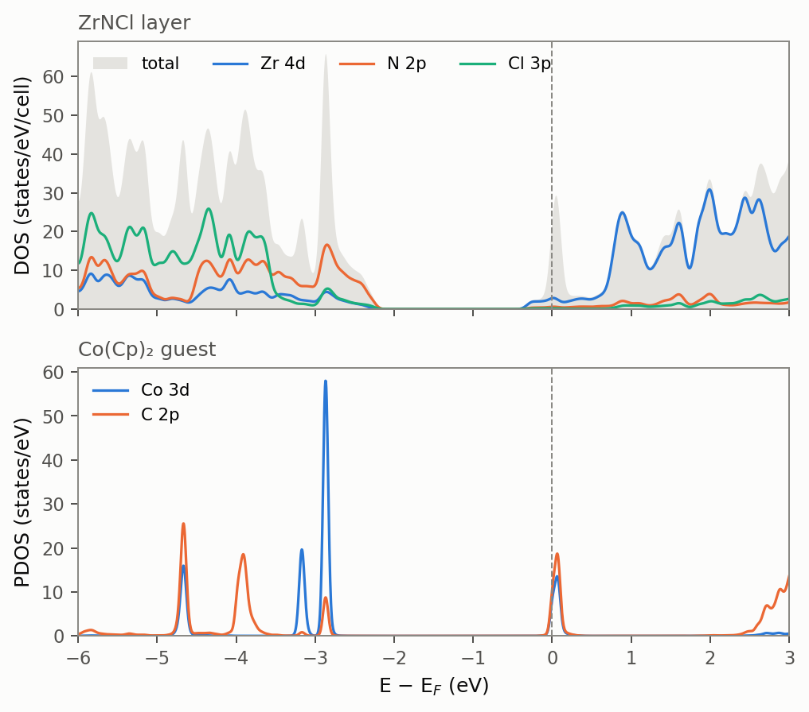
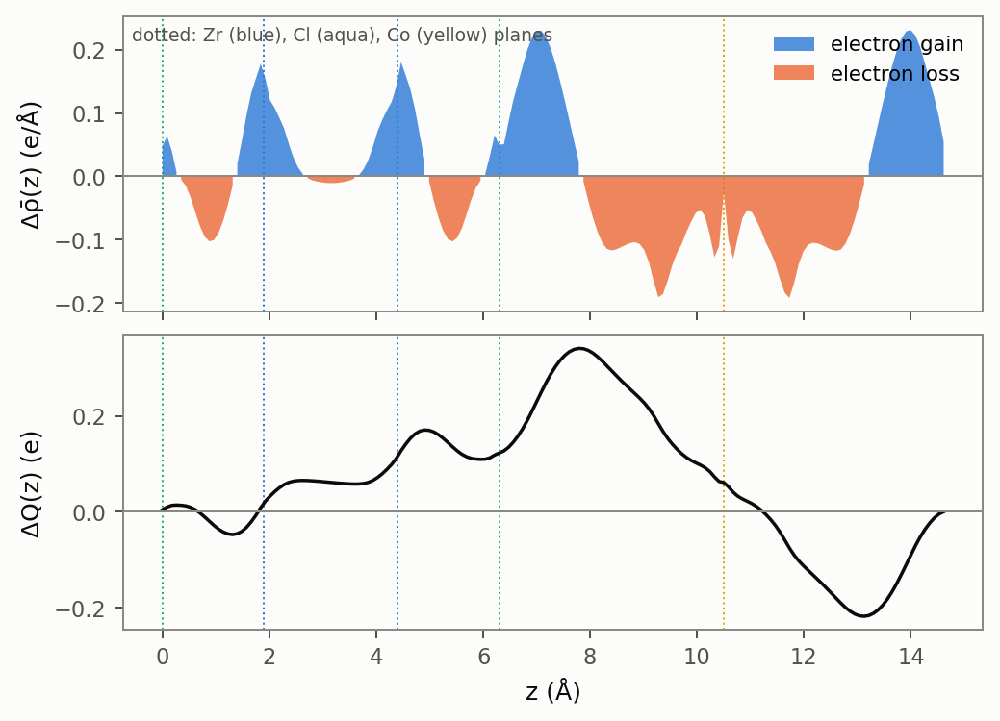
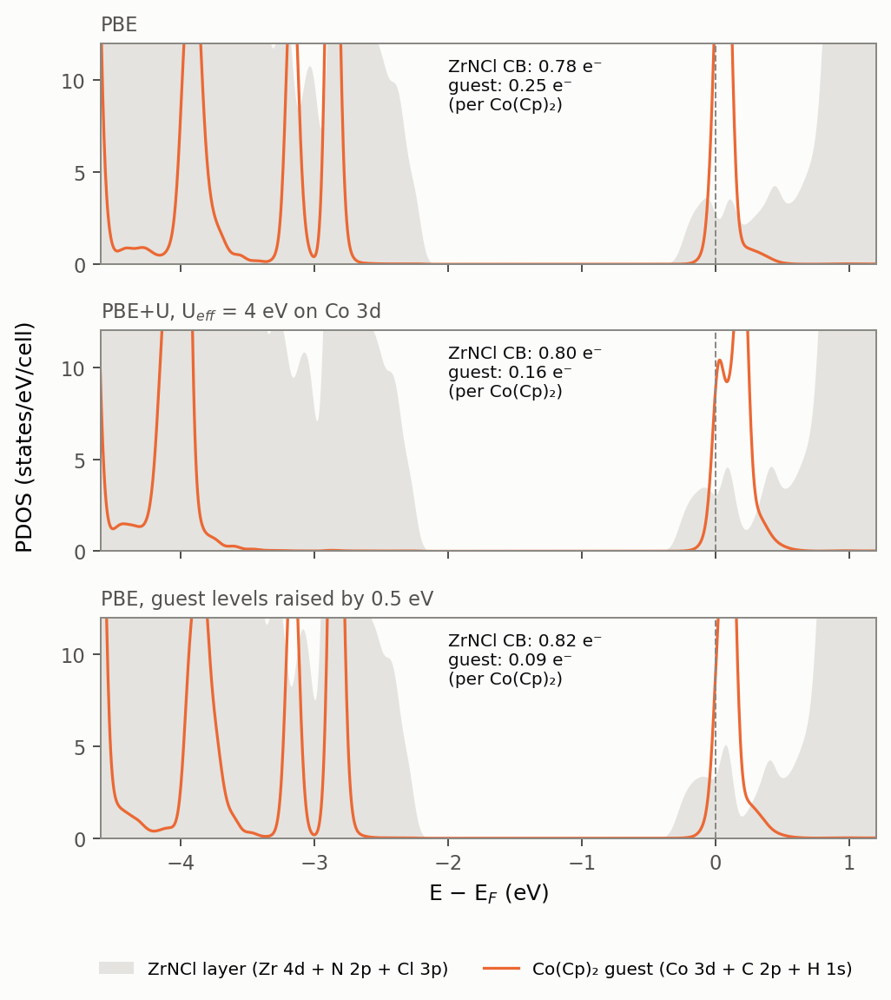
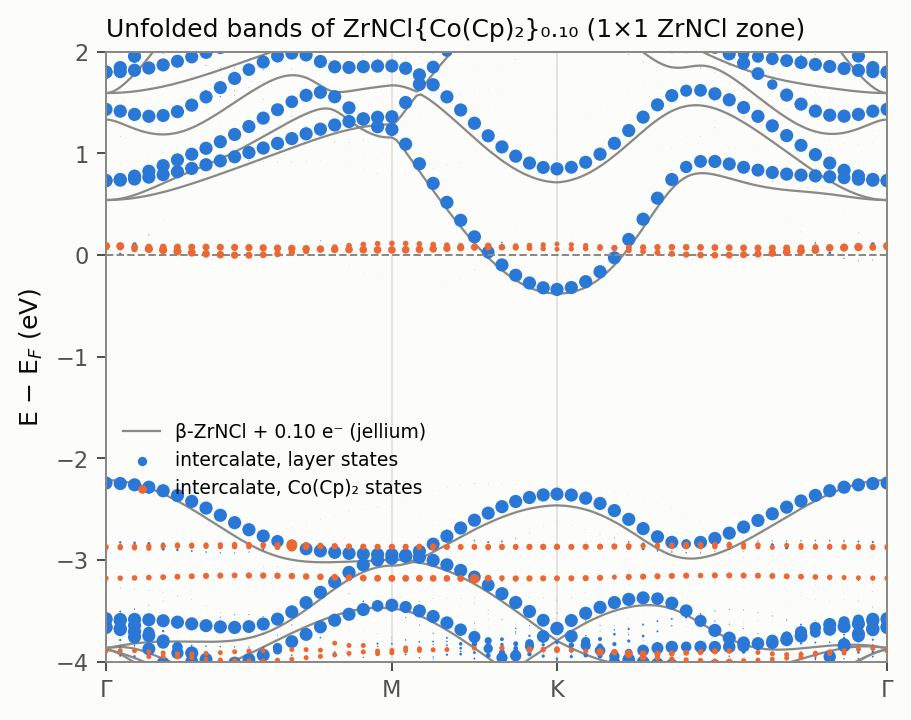
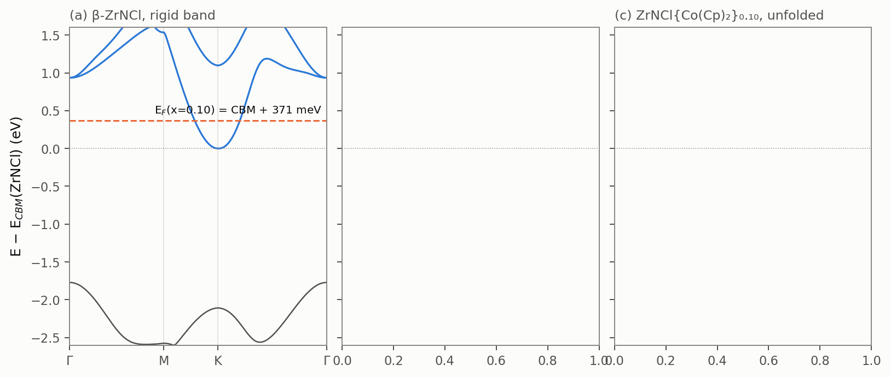

# β-ZrNCl → electron-doped β-ZrNCl → ZrNCl{Co(Cp)₂}₀.₁₀: a DFT study

Companion calculations to **A. M. Fogg, V. M. Green, D. O'Hare, "Superconducting Metallocene Intercalation
Compounds of β-ZrNCl", *Chem. Mater.* 11, 216 (1999)**. That paper reports:
- Co(Cp)₂, Co(Cp′)₂ and Co(Cp*)₂ intercalate into β-ZrNCl at x ≈ 0.09–0.15 guests per ZrNCl.
- The basal spacing rises from 9.2 Å to 14.7 Å (Cp, Cp′) and 16.5 Å (Cp*), with the metallocene axis parallel to the
  layers.
- The room-temperature conductivity rises from 4×10⁻⁷ to 5.6 S cm⁻¹.
- All three compounds are type-II bulk superconductors at T_c = 14 K, the same T_c as the alkali-metal intercalates.
- The authors close by hoping that "future band structure calculations on β-ZrNCl will provide further insights."

This directory does that in three steps: (1) the pristine host, (2) the host doped with extra electrons, and (3) the full
guest–host compound.

> Method in one line: GPAW 24.1 plane-wave PAW, PBE (+D3(BJ) for geometries), 600 eV, experimental lattice.
> [METHODS.md](METHODS.md) has the details.



## 1. Pristine β-ZrNCl

**Structure.** The internal coordinates barely move when relaxed at the experimental cell, with or without D3. The
largest shift is 0.02–0.03 Å, on Cl. At fixed cell, D3 changes the bond lengths by at most 0.005 Å.

| hexagonal setting, all atoms on 6c (0,0,z) | a (Å) | c (Å) | z(Zr) | z(N) | z(Cl) | Zr–N ×3 (Å) | Zr–N apical (Å) | Zr–Cl ×3 (Å) |
|---|---|---|---|---|---|---|---|---|
| starting model | 3.6046 | 27.672 | 0.1196 | 0.1981 | 0.3888 | 2.126 | 2.172 | 2.735 |
| PBE, experimental cell | 3.6046 | 27.672 | 0.1195 | 0.1976 | 0.3878 | 2.129 | 2.164 | 2.751 |
| PBE+D3(BJ), experimental cell | 3.6046 | 27.672 | 0.1196 | 0.1976 | 0.3880 | 2.129 | 2.159 | 2.749 |
CELL_RELAXED_ROW

**Electronic structure** ([figure](figures/pristine_bands_dos.png)):



- **Band insulator.** The Zr⁴⁺ d⁰ ions give a PBE gap of **1.77 eV**, indirect from Γ (VBM) to K (CBM). The smallest
  direct gap is 2.11 eV, at K.
  - Semilocal DFT underestimates the gap. The experimental optical gap is larger, of order 3 eV.
  - The conductivity of 4×10⁻⁷ S cm⁻¹ quoted in the paper is that of an insulator.
- **Valence-band top.** Mainly N 2p (with Cl 3p); it disperses by 0.26 eV along k_z.
- **Conduction-band bottom.** Zr 4d at K: 83 % of the PAW-projected weight is Zr 4d, almost all of it in-plane
  d_xy/d_x²−y², with 16 % N 2p.
  - The next conduction band at K lies 1.10 eV higher.
  - A second valley at Γ lies 0.94 eV above the CBM.
  - Light electron doping therefore fills only the two K/K′ valleys.
- **The conduction band is two-dimensional exactly at K.**
  - E(K, k_z) varies by only 0.1 meV: in the rhombohedral (ABC) stacking the interlayer hopping cancels at K by the
    three-fold phase factors.
  - Away from K the interlayer terms grow roughly linearly. At |k−K| = 0.067 Å⁻¹, E varies by 16 meV along k_z; at
    0.134 Å⁻¹, by 31 meV.
  - The in-plane curvature at k_z = 0 gives m* = 0.85 (K→Γ) / 0.68 (K→M) mₑ. That point is the bonding bottom of the
    k_z band.
  - The k_z-averaged density of states corresponds to a **DOS mass m*_DOS = 0.58 mₑ**, i.e. N_CB = 0.27–0.29
    states eV⁻¹ ZrNCl⁻¹ just above the CBM.

## 2. Electron-doped β-ZrNCl: rigid band vs. extra electrons

Doping is modelled in two ways, x electrons per ZrNCl in both cases:

- **Strict rigid band.** The pristine bands are frozen and E_F is moved until the conduction band holds x electrons.
  E_F comes from electron counting with the tetrahedron DOS on the dense 30×30×3 mesh.
- **Extra electrons with a jellium background.** The calculation is self-consistent with −2x electrons per Zr₂N₂Cl₂.
  The bands relax around the added charge, which sits on a uniform positive background.
  - Run on a series of x values with the 18×18×2 SCF mesh.
  - At x = 0.10 it is repeated with the full band/DOS treatment (dense 30×30×3 mesh), because that is the doping
    level of ZrNCl{Co(Cp)₂}₀.₁₀.



| x (e/ZrNCl) | E_F−E_CBM rigid (meV) | E_F−E_CBM SCF (meV) | N(E_F) rigid | N(E_F) SCF | k_F 2D (1/Å) |
|---|---|---|---|---|---|
| 0.025 | 100 | 112 | 0.283 | 0.239 | 0.118 |
| 0.050 | 192 | 209 | 0.282 | 0.278 | 0.167 |
| 0.100 | 371 | 390 | 0.289 | 0.276 | 0.236 |
| 0.150 | 542 | 567 | 0.302 | 0.302 | 0.289 |
| 0.200 | 702 | 731 | 0.324 | 0.330 | 0.334 |
| 0.300 | 954 | 935 | 1.127 | 1.251 | 0.409 |
| 0.400 | 1032 | 996 | 1.520 | 1.568 | 0.473 |

N(E_F) in states eV⁻¹ ZrNCl⁻¹ (both spins); self-consistent values from tetrahedron electron counting on the 18×18×2 SCF mesh (at x = 0.10 a 24×24×2 SCF gives 382 meV / 0.281, the dense-mesh result below 378 meV / 0.284).

**Findings.**

1. **The rigid-band picture holds well for the filling.**
   - For x ≤ 0.2 the self-consistent E_F − E_CBM exceeds the rigid-band value by only 4–8 % (at x = 0.10: 390 meV vs
     371 meV).
   - N(E_F) is the same within the mesh accuracy.
   - At x = 0.10 the carriers fill two small, nearly circular pockets at K and K′ with k_F ≈ 0.24 Å⁻¹. Each pocket
     covers 5 % of the Brillouin zone.
   - N(E_F) ≈ 0.28 states eV⁻¹ ZrNCl⁻¹ and is flat in x up to x ≈ 0.25, the two-dimensional constant-DOS signature.
   - Near x ≈ 0.28 E_F reaches the Γ valley (0.9 eV above the K minimum) and N(E_F) jumps three- to fourfold.
2. **Where the rigid band fails.**
   - The self-consistent charge separates the host bands: the K-conduction-band bottom rises relative to the Γ-valence
     top by about +65 meV per 0.1 e⁻, from 1.77 eV at x = 0 to 2.02 eV at x = 0.4.
   - The Γ valley comes down relative to K by up to 50 meV.
   - Both effects are electrostatic: the added electrons sit in the Zr planes and the compensating charge is spread
     through the van der Waals gap. In the real intercalate that charge sits on the guests in the gallery.
3. **The lattice responds.** Relaxing the internal coordinates at x = 0.10 changes the bonds as follows:
   - Zr–Cl lengthens by 0.020 Å (2.751 → 2.771 Å) and the mean Zr–N shortens by 0.008 Å (2.138 → 2.130 Å). Both
     structures are PBE at the experimental cell.
   - The energy drops by 18 meV per cell.
   - The Γ valley moves up to 1.06 eV above the K minimum, while E_F − E_CBM barely changes (398 meV).

**x = 0.10 on the dense mesh.** The SCF used 18×18×3 k-points; the bands and DOS were evaluated on 30×30×3 with the
tetrahedron method.

| | strict rigid band | extra e⁻ + jellium (frozen lattice) |
|---|---|---|
| E_F − E_CBM(K) | 371 meV | 378 meV |
| N(E_F) (states eV⁻¹ ZrNCl⁻¹, both spins) | 0.289 | 0.284 |
| gap VBM(Γ) → CBM(K) | 1.772 eV | 1.838 eV |
| Γ valley above CBM | 0.935 eV | 0.918 eV |
| in-plane CB mass at K, k_z = 0 (K→Γ / K→M) | 0.85 / 0.68 | 0.83 / 0.66 |
| k_F (Luttinger, 2 valleys) | 0.236 Å⁻¹ | 0.236 Å⁻¹ |




The Fermi contours of the two descriptions lie on top of each other: two slightly trigonal pockets of radius
≈ 0.24 Å⁻¹ centred on K and K′. For the occupied states, the rigid band is essentially exact at this doping. What it
misses is the ≈ 65 meV relative shift of the valence band.

## 3. The full intercalate ZrNCl{Co(Cp)₂}₀.₁₀

**Model.**
- Composition: one ZrNCl double layer (10 formula units) plus one Co(Cp)₂ per gallery (51 atoms), i.e. exactly the
  analysed composition ZrNCl{Co(Cp)₂}₀.₁₀.
- Cell: basal spacing fixed at the measured 14.7 Å; in-plane √3a × √7a supercell giving 56.3 Ų per guest.
- Guest orientation: Cp–Co–Cp axis parallel to the layers, as the paper infers from the Cp/Cp′/Cp* series. Along the
  6.24 Å cell vector the guests interdigitate ring-edge to ring-edge.
- Relaxation: PBE+D3(BJ), all atoms, residual force 0.021 eV/Å.

**Relaxed geometry** ([figure](figures/structures.png)):

| ZrNCl layer | pristine (PBE) | jellium x = 0.10 (PBE) | pristine (PBE+D3) | in ZrNCl{Co(Cp)₂}₀.₁₀ (PBE+D3) |
|---|---|---|---|---|
| Zr–N (mean of 4) | 2.138 Å | 2.130 Å | 2.136 Å | 2.131 Å (2.120–2.157) |
| Zr–Cl (×3) | 2.751 Å | 2.771 Å | 2.749 Å | 2.780 Å (2.769–2.790) |
| Cl–Cl slab thickness | 6.211 Å | 6.227 Å | 6.199 Å | 6.264 Å |

GUEST_TABLE

- The guest shrinks from the neutral-cobaltocene starting geometry (Co–C 2.10 Å) to Co–C = 2.058 Å and
  Co–(Cp centroid) = 1.659 Å, which is cobaltocenium-like. See the isolated-molecule references in the table.
- The uppermost and lowermost Cp hydrogens sit in the Cl hollows of the two walls: H···Cl 2.70 Å, Co 4.2 Å above the
  Cl plane.
- The host responds as it does to jellium doping, only more strongly. Each comparison below is like-for-like
  (PBE+D3 with PBE+D3, PBE with PBE):
  - Zr–Cl lengthens by 0.031 Å; jellium doping at x = 0.10 gives 0.020 Å.
  - Zr–N shortens slightly in both cases (−0.005 / −0.008 Å).
  - The Cl–Cl slab thickness grows by 0.065 Å, four times the jellium value (0.016 Å). The positively charged guests
    pull the Cl planes outward, an effect the uniform jellium background cannot produce.

**Electronic structure and charge transfer** (PBE; SCF on 9×9×1 k with 0.02 eV Fermi–Dirac smearing; tetrahedron
DOS; E_F from electron counting):



| quantity (per Co(Cp)₂ unless stated) | PBE, 9×9×1, σ = 0.02 eV | PBE, 6×6×1, σ = 0.05 eV |
|---|---|---|
| electrons in ZrNCl conduction-band states | **0.76** | 0.73 |
| electrons left in the guest e₁″ band | 0.24–0.28 | 0.27 |
| effective doping x_eff (e⁻/ZrNCl) | **0.076** | 0.073 |
| E_F − E_CBM(ZrNCl layer) | 339 meV | 280 meV (smearing-limited) |
| guest e₁″ band relative to E_F | −0.00 … +0.11 eV (pinned at E_F) | +0.05 … +0.18 eV |
| occupied Co 3d (a₁′, e₂′) | −2.9 … −3.2 eV (below the layer VBM at −2.24 eV) | – |
| ZrNCl layer gap (VBM → CBM) | 1.90 eV | – |
| layer-type DOS at the CB bottom | 0.26 states eV⁻¹ ZrNCl⁻¹ | – |
| Bader charge of Co(Cp)₂ (all-electron density) | **+0.64 e** (Co +0.59) | – |
| Bader: Zr / N / Cl (pristine: +2.27 / −1.60 / −0.67) | +2.24 / −1.61 / −0.69 | – |

**Where the charge goes.** The figure shows the plane-averaged density difference
Δρ̄(z) = ρ[intercalate] − ρ[ZrNCl slab] − ρ[neutral Co(Cp)₂ lattice] at frozen geometry, and its running integral
ΔQ(z).



- Electrons leave the guest region: 0.56 e between the two extrema of ΔQ(z), which lie in the gallery about 1.5 Å
  outside the Cl planes.
- Most of this charge piles up on the gallery side of the Cl planes, +0.22 e on each side. The slab interior gains a
  net 0.1 e: the Zr planes gain 0.22 e and the Zr–Cl bond region loses some.
- The plane average mixes two effects:
  - the filling of Zr-4d conduction states (≈ 0.8 e by state counting);
  - the polarisation of the whole slab towards the cations, as the Cl density shifts toward the guests.
- So it does not say by itself how many electrons occupy the conduction band. The amount that crosses into the slab
  side, 0.56 e, is in line with the Bader charge of +0.64 e.

**Magnetism, +U and guest-level checks.** Is the incomplete transfer robust? Three checks, all at the same geometry
on a 6×6×1 mesh with σ = 0.02 eV (PBE on that mesh is the reference column):



| per Co(Cp)₂ | PBE | PBE+U, U_eff = 4 eV on Co 3d | PBE, guest levels +0.5 eV |
|---|---|---|---|
| electrons in ZrNCl conduction-band states | 0.78 | 0.80 | 0.82 |
| electrons left in guest states at E_F | 0.25 | 0.16 | 0.09 |
| E_F − E_CBM(ZrNCl layer) | 292 meV | 321 meV | 333 meV |
| guest e₁″ band relative to E_F | −0.00 … +0.12 eV | +0.01 … +0.21 eV | +0.01 … +0.14 eV |
| top of the occupied Co 3d (a₁′/e₂′) levels | −2.84 eV | −3.97 eV | −2.82 eV |

On this coarse mesh the state counts carry an uncertainty of about ±0.05 e: the two columns of each case add up to
0.91–1.03 instead of 1. The shift of E_F − E_CBM, read with the layer DOS of 2.66 states eV⁻¹ per cell, measures the
change in the layer's filling independently.

- **Spin.** ⟪SPIN⟫
- **+U on Co 3d barely matters.**
  - U_eff = 4 eV pushes the filled a₁′/e₂′ levels down by 1.1 eV but lifts the e₁″ band by only 0.01–0.09 eV. The
    split moves by ≈ 0.05 e.
  - The reason is the Co 3d occupation matrix of the PBE ground state, in the frame of the Cp–Co–Cp axis:
    d_z² (a₁′) 0.99, d_xy/d_x²−y² (e₂′) 0.93, d_xz/d_yz (e₁″) 0.62–0.65 per spin orbital.
  - The e₁″ orbitals mix covalently with the filled Cp π e₁ combination, so their d occupation stays near ½ even
    though the antibonding e₁″* level is almost empty. Dudarev's correction shifts an orbital by U(½ − n), which is
    therefore almost zero for exactly the level in question.
  - Correcting this level needs a correction on the molecular orbital, not on the Co atom.
- **Raising the guest levels barely moves them.**
  - An external potential of +0.5 eV on the guest (smooth spheres around Co and C) moves only 0.11–0.15 e more into
    the layer: E_F − E_CBM rises by 41 meV.
  - The e₁″ band stays at E_F.
  - Self-consistency screens almost 90 % of the applied shift. In absolute terms the guest levels rise by
    0.17–0.18 eV, but the layer bands rise by 0.11–0.12 eV with them.
  - The restoring force is ≈ 3–4 eV per transferred electron per guest.
- **Why: the electrostatics of the gallery.** It takes a large voltage to charge the gallery.
  - The guest plane sits 6.06 Šfrom the nearest Zr plane on either side, with one guest per 56.3 Ų.
  - Moving one electron per guest from that plane to the two Zr planes builds up a double-layer potential of 9.8 V
    (parallel-plate estimate, unscreened). A gallery dielectric constant of 2.5–3 brings this down to the 3–4 eV
    found above.
  - This potential is classical electrostatics, present in any functional; it is not a self-interaction artefact.
  - It pins the guest's donor level to E_F once ≈ 0.8 e have been transferred. Completing the transfer would need that
    level about 1 eV higher (≈ 0.2 e × 4 eV, plus clearing the band of E_F) than PBE places it.
- **What this means.**
  - The incomplete transfer is not a fragile detail that a modest correction to PBE removes.
  - An error of 1 eV in a molecule–host level alignment is within the range typical of semilocal DFT, but it could
    point either way. PBE places the nearly empty guest level too deep, which favours less transfer. It also places
    the ZrNCl conduction band too low (gap 1.77 eV vs ~3 eV), which favours more.
  - Best estimate: **0.8–0.9 e per guest, x_eff = 0.08–0.09**. Complete ionisation cannot be excluded.

**Unfolded band structure.** The supercell states are projected back onto the 1×1 ZrNCl zone. The spectral weights
are clean: 93 % of the layer states have weight > 0.8 or < 0.2.



- **The host bands are almost those of the jellium-doped host** (grey lines). This holds for the valence band, the
  K-valley conduction band (bottom at E_F − 0.34 eV, k_F = 0.21–0.23 Å⁻¹) and the higher Zr-4d bands.
  - The main visible difference is that the Γ valley sits higher: 1.08 eV above the K minimum, as in the jellium host
    after internal relaxation (1.06 eV). The Zr–Cl expansion causes this.
  - Neither the guest's electrostatic potential nor its hybridisation reshapes the Zr-4d band.
- **The guest contributes flat levels.** The occupied Co 3d (a₁′/e₂′) levels lie at −2.9 and −3.2 eV, inside the
  ZrNCl valence-band energy range. The e₁″ band (bandwidth ≈ 0.1 eV, from guest–guest overlap along the 6.24 Å rows)
  lies at E_F.
- **Luttinger count.** The Fermi wave vector corresponds to 0.08–0.09 e⁻/ZrNCl, consistent with the 0.076 e⁻/ZrNCl
  from state counting. Both lie below the 0.10 that complete ionisation of every guest would give.

## 4. Three levels of description side by side



All three panels are aligned at the K conduction-band minimum of the ZrNCl layer.

| | (a) rigid band, x = 0.10 | (b) 0.10 e⁻ + jellium (SCF) | (c) ZrNCl{Co(Cp)₂}₀.₁₀ (PBE) |
|---|---|---|---|
| electrons in the Zr-4d conduction band, per ZrNCl | 0.10 (imposed) | 0.10 (imposed) | 0.076 (state count), 0.087 (Luttinger) |
| where the compensating positive charge sits | nowhere (bands frozen) | uniform background | on the guest (Bader +0.64 e) |
| E_F − E_CBM(K) | 371 meV | 378 meV (relaxed: 398 meV) | 339 meV |
| N(E_F), states eV⁻¹ ZrNCl⁻¹ | 0.289 | 0.284 (relaxed: 0.270) | 0.26 (layer states) |
| k_F around K | 0.236 Å⁻¹ | 0.236 Å⁻¹ | 0.21–0.23 Å⁻¹ |
| gap VBM(Γ) → CBM(K) | 1.77 eV | 1.84 eV | 1.90 eV |
| Γ valley above the K minimum | 0.94 eV | 0.92 eV (relaxed: 1.06 eV) | 1.08 eV |
| other states at E_F | – | – | guest e₁″ band, 0.24 e per guest |

**(a) → (b): adding the electrons self-consistently.**
- The filling is almost unchanged: E_F, N(E_F) and k_F agree within 2 %.
- What changes is the valence band, which the extra charge pushes down relative to the K valley (+65 meV of gap per
  0.1 e⁻).
- Relaxing the lattice around the added charge (Zr–Cl +0.02 Å) lifts the Γ valley by 0.14 eV. Nothing else moves
  appreciably.

**(b) → (c): replacing the jellium by real Co(Cp)₂ donors.**
- The host bands stay those of the relaxed jellium host: the K pocket, its mass, and the Γ valley at 1.08 eV. Section 3
  shows the unfolded bands.
- The larger layer gap (1.90 eV) comes from the 14.7 Å spacing: it removes the interlayer dispersion of the valence
  band (0.26 eV along k_z in the pristine stacking). The K valley has no such dispersion to lose.
- The one difference that matters is the filling. In PBE each guest keeps ≈ 0.2 e in its e₁″ level, so the host is
  doped to x_eff ≈ 0.08–0.09 instead of 0.10. That lowers E_F by ≈ 40 meV and leaves N(E_F) unchanged.

**Bottom line.** For the conduction electrons, "β-ZrNCl + x e⁻" with x between 0.08 and 0.10 describes
ZrNCl{Co(Cp)₂}₀.₁₀ quantitatively, whether as a rigid band or on jellium. The guest has three roles:
1. It sets x.
2. It opens the gallery, which decouples the layers but changes nothing at K.
3. It adds flat molecular levels. The occupied Co 3d levels lie ~3 eV below E_F. The e₁″ level is pinned at E_F by
   the electrostatics of the charged gallery and holds the 0.1–0.2 e that the host does not receive.

## 5. What this says about the paper's observations

**1. "Intercalation turns an insulator (4×10⁻⁷ S cm⁻¹) into a metal (5.6 S cm⁻¹)."**
- Pristine β-ZrNCl is a band insulator (PBE gap 1.77 eV, larger in reality).
- In the intercalate E_F lies 0.34 eV inside the Zr-4d conduction band. There are two Fermi pockets, at K and K′
  (k_F ≈ 0.22 Å⁻¹), holding 0.08–0.10 electrons per ZrNCl.
- The metal belongs to the host. The guest donates electrons but contributes no dispersive states at E_F.
- A pressed-pellet conductivity is limited by grain boundaries, so no intrinsic value is compared here.

**2. "T_c = 14 K for x = 0.09, 0.10 and 0.15, for 14.7 Å and 16.5 Å spacings, and for the alkali intercalates, so the
superconductivity is confined to the ZrN layers."** The calculations supply the electronic basis for this inference:
- **Doping independence.** N(E_F) = 0.28 states eV⁻¹ ZrNCl⁻¹ from x = 0.025 to ≈ 0.25, the constant DOS of the two 2D
  valleys.
  - Between x = 0.09 and 0.15 the carrier number changes by 60 % and N(E_F) by less than 5 %.
  - E_F reaches the Γ valley only at x ≈ 0.28.
  - In any picture where T_c is set by N(E_F) and the phonons, as in BCS, this gives a doping-independent T_c. The
    calculation is consistent with the observation; it does not prove the mechanism.
- **Independence of the interlayer spacing.** The conduction-band states at K live in the Zr–N double layer
  (83 % Zr 4d, 16 % N 2p).
  - Even at the pristine 9.2 Å spacing they disperse by only 0.1 meV along k_z, because the rhombohedral stacking
    cancels the interlayer hopping at K. Elsewhere on the Fermi pockets the interlayer coupling is 16–31 meV.
  - At 14.7 Å, with real guests in the gallery, the layer bands near E_F are those of the doped host.
  - The Fermi-level electrons are therefore two-dimensional and insensitive to the gallery height and its contents. A
    guest that changes the spacing, Cp* instead of Cp, should not change T_c.
- **The guests are spectators.** Their occupied levels lie ~3 eV below E_F. Their e₁″ level at E_F has a bandwidth of
  only 0.1 eV, and it does not reshape the layer's conduction band (section 3, unfolded bands).

**3. The doping level.** Elemental analysis gives x = 0.10 guests per ZrNCl. Fogg et al. assume one electron per
guest.
- **How much charge moves.** PBE transfers most but not all of each guest's electron.
  - The estimates: 0.76 e from state counting, 0.87 e from the Luttinger count, and 0.8–0.9 e in the +U and
    guest-shift checks. Bader puts +0.64 e on Co(Cp)₂.
  - The host is therefore doped to x_eff = 0.08–0.09 rather than 0.10.
- **Why the transfer stops short.** The limit is the electrostatics of the charged gallery. It pins the guest's e₁″
  level to E_F (section 3).
  - Complete transfer would need the donor level about 1 eV higher than PBE puts it. That is within the uncertainty of
    a semilocal functional for this alignment, so neither outcome can be excluded.
- **What a fractional charge would mean in a real crystal.** Each molecule carries an integer charge. A fractional
  average therefore means a mixture: Co(Cp)₂⁺ plus 10–20 % neutral Co(Cp)₂ with S = ½.
  - A Curie term in the normal-state susceptibility would reveal such neutral guests. The paper shows no normal-state
    susceptibility.
  - That T_c equals that of the alkali-metal intercalates argues weakly against many magnetic guests near the layers.
- **Either way, the doping lies in the flat-N(E_F) window**, so points 1 and 2 do not depend on the exact split.

**4. Superconducting length scales.** This is an order-of-magnitude consistency check only.
- **From the bands at x = 0.10:** ħv_F = 2.9–3.5 eV Å, i.e. v_F = 4.4–5.3 × 10⁵ m/s (the pockets are trigonally
  warped).
  - With a weak-coupling gap Δ = 1.76 k_B T_c = 2.1 meV, the BCS coherence length is ξ₀ = ħv_F/(πΔ) ≈ 45–50 nm.
  - Δ/E_F ≈ 0.006 and k_F ξ₀ ≈ 100, which puts the compound on the BCS side.
- **From the paper's critical fields** (H_c2 = 0.45 T for Cp, 0.50 T for Cp′, 0.70 T for Cp*, measured on powders at
  3 K): read as H_c2 = Φ₀/(2πξ²), they give ξ_GL ≈ 27, 26 and 22 nm.
- **Comparison.** These are of the same order as ξ₀; the clean-limit GL value would be 0.74 ξ₀ ≈ 35 nm.
  - A somewhat shorter ξ_GL is what a mean free path of a few tens of nm would give.
  - The resistivity upturn below 70 K also points to disorder.

**5. Later work.**
- **Band structure.** Band calculations on LiₓZrNCl and NaₓHfNCl reached the same picture: the electrons enter a single
  light band of in-plane d_xy/d_x²−y² character ([Weht, Filippetti & Pickett, EPL 48, 320
  (1999)](https://iopscience.iop.org/article/10.1209/epl/i1999-00484-4)). The intercalate calculation here shows that a
  molecular donor gives the same conduction band.
- **The value of T_c is not explained by this work.**
  - In LiₓZrNCl, T_c rises sharply when x is reduced below ≈ 0.12, just before the superconductor–insulator transition
    ([Taguchi, Kitora & Iwasa, PRL 97, 107001 (2006)](https://link.aps.org/doi/10.1103/PhysRevLett.97.107001)). A
    constant N(E_F) alone cannot produce that rise.
  - Ab initio electron–phonon calculations gave an average coupling λ ≈ 0.5, too weak for the observed T_c in standard
    Eliashberg theory ([Heid & Bohnen, PRB 72, 134527 (2005)](https://doi.org/10.1103/PhysRevB.72.134527)).
  - At low carrier density, gate-doped ZrNCl crosses over from BCS towards BEC-like pairing ([Nakagawa et al., Science
    372, 190 (2021)](https://doi.org/10.1126/science.abb9860)).
- **What this work answers.** The paper's hope, that band-structure calculations would give "further insights into the
  origins of the superconductivity", is answered only partly. The calculations explain why T_c does not care about the
  guest, the gallery height or the exact doping. The pairing mechanism needs electron–phonon (and possibly
  beyond-phonon) calculations that were not done here.

## Caveats

- **Functional.** PBE underestimates the host gap and misplaces molecular levels.
  - The charge split (0.8–0.9 e per guest instead of 1) depends on how the cobaltocene donor level aligns with the
    ZrNCl conduction band.
  - The +U and guest-shift checks show that the electrostatics of the gallery stiffly pin this alignment. Still, an
    alignment error of ~1 eV would be enough to complete the transfer.
  - Hybrid-functional or GW level alignment would be the proper test. It was out of reach for a 51-atom metallic cell
    on this machine.
- **Ordered model.** The intercalate is an ordered, AA-stacked model at exactly x = 1/10.
  - The real compound is powder-crystalline, probably with disordered guests and its own stacking.
  - The resistivity upturn below ~70 K reported in the paper (weak localisation) is a disorder effect that this model
    cannot capture.
- **Geometry constraints.** The cell is fixed at the measured basal spacing and the experimental in-plane lattice
  constant.
  - The relaxation keeps the mirror symmetry (space group Cm) of the starting model, so the "axis parallel to the
    layers" orientation is imposed, not predicted.
- **Jellium doping.** It spreads the compensating charge uniformly, including through the van der Waals gap. It is a
  model of doping, not of any particular donor.
- **Scope.** No electron–phonon coupling was computed, so nothing here predicts T_c.

## Reproducing

All jobs were run through `runs/queue.sh` (4 MPI ranks each). `runs/queue.txt` and `runs/queue.log` record the exact
order and timing. In short:

```bash
mpiexec -n 4 python 01_pristine/convergence.py            # cutoff scan -> analysis/parse_convergence.py
mpiexec -n 4 python 01_pristine/convergence_k.py          # k-mesh check
mpiexec -n 4 python 01_pristine/relax.py --mode pbed3     # also --mode pbe, --mode pbed3_cell
mpiexec -n 4 python 01_pristine/electronic.py              # bands, DOS/PDOS, masses
mpiexec -n 4 python 02_doped/series.py                     # jellium doping series + relaxation at x = 0.1
mpiexec -n 4 python 01_pristine/electronic.py --charge -0.2 --tag x0.10 --kscf 18 18 3
python 03_intercalate/build.py                             # ordered x = 1/10 model
mpiexec -n 4 python 03_intercalate/relax.py --stage pw     # PBE+D3 relaxation of the intercalate
mpiexec -n 4 python 03_intercalate/electronic.py --stage scf   # then --stage unfold, charges,
                                                                # scfU --U 4, scfU --U 0, shift --dV 0.5,
                                                                # fragments, spin
mpiexec -n 4 python 03_intercalate/molecule.py             # isolated Co(Cp)2 / Co(Cp)2+
mpiexec -n 4 python 03_intercalate/symmetry_check.py       # orientation test without the mirror plane
python 03_intercalate/geometry.py
python analysis/rigid_band.py && python analysis/plot_*.py && python analysis/summary.py
```

Software: GPAW 24.1.0, ASE 3.22.1, libxc 5.2.3, OpenBLAS 0.3.26, simple-dftd3 1.6.0, pybader, spglib 2.3.1
(Ubuntu 24.04 packages plus pip). Large restart files (`*.gpw`) and densities (`*.npy`) are not committed.
The GPAW text outputs of every run are in `runs/`.
